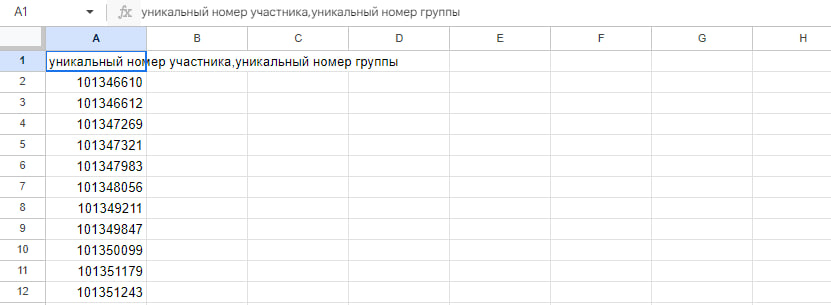

# Московское долголетие

### Web-сервис, который поможет подобрать активности участникам программы "МОСКОВСКОЕ ДОЛГОЛЕТИЕ"

P.S
Картинки кликабельны

### Команда

| Участник | Роль |
| ---- | ------ |
| Авдюшин Добрыня | Лидер команды, back-end разработчик |
| Герасимов Дмитрий | Аналитик |
| Львов Никита | Front-end разработчик |
| Смирнов Сергей | UX/UI дизайнер |
| Ивонина Елизавета | UX/UI дизайнер |
